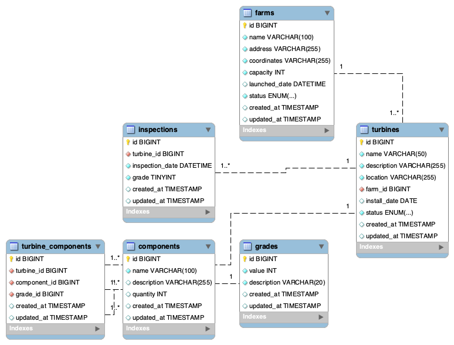

## About Software Development @ Cyberhawk

need some content for this section

## The task
We've designed this task to try and give you the ability to show us what you can do and hopefully flex your technical and creative muscles. You can't show off too much here, show us you at your best and wow us!

To make things as simple as we could, we've opted to use [Laravel Sail](https://laravel.com/docs/8.x/sail) to provide a quick and convenient development environment, this will require you to install
[Docker Desktop](https://www.docker.com/products/docker-desktop) before you can start the test. We've provided [some more detailed instructions](#setting-everything-up) below in case this is your first time using Docker or Sail.

We'd like you to build an application that will display an example wind farm, its turbines and their components.
We'd like to be able to see components and their grades (measurement of damage/wear) ranging between 1 - 5.

For example, a turbine could contain the following components:
- Blade
- Rotor
- Hub
- Generator

Don't worry about using real names for components or accurate looking data, we're more interested in how you structure the application and how you present the data.

Don't be afraid of submitting incomplete code or code that isn't quite doing what you would like, just like your maths teacher, we like to see your working.
Just Document what you had hoped to achieve and your thoughts behind any unfinished code, so that we know what your plan was.

### Requirements
- Display a list of turbine inspections
- Each Turbine should have a number of components
- A component can be given a grade from 1 to 5 (1 being perfect and 5 being completely broken/missing)
- Use Laravel Models to represent the Entities in the task.

### Bonus Points
- Great UX/UI
- Use of React JS
- Use of Tailwind CSS
- Use of 3D
- Use of a web map technology in the display of the data
- Automated tests
- API Authentication
- Use of coding style guidelines (we use PSR-12 and AirBnb)
- Use of git with clear logical commits
- Specs/Plans/Designs

### Submitting The Task
We're not too fussy about how you submit the task, providing it gets to us and we're able to run it we'll be happy however here are some of the ways we commonly see:
- Fork this repo, work and add us as a collaborator on your GitHub repo and send us a link
- ZIP the project and email it to us at nick.stewart@thecyberhawk.com

## Setting Everything Up
As mentioned above we have chosen to make use of Laravel Sail as the foundation of this technical test.
- If you haven't already, you will need to install [Docker Desktop](https://www.docker.com/products/docker-desktop).
- One that is installed your next step is to install this projects composer dependencies (including Sail).
    - This will require either PHP 8 installed on your local machine or the use of [a small docker container](https://laravel.com/docs/8.x/sail#installing-composer-dependencies-for-existing-projects) that runs PHP 8 that can install the dependencies for us.
- If you haven't done so already copy the `.env.example` file to `.env`
    - If you are running a local development environment you may need to change some default ports in the `.env` file
        - We've already changed mysql to 33060 and NGINX to 81 for you
- It should now be time to [start Sail](https://laravel.com/docs/8.x/sail#starting-and-stopping-sail) and the task

### Installing Composer Dependencies
https://laravel.com/docs/9.x/sail#installing-composer-dependencies-for-existing-projects
```bash
docker run --rm \
-u "$(id -u):$(id -g)" \
-v $(pwd):/var/www/html \
-w /var/www/html \
laravelsail/php81-composer:latest \
composer install --ignore-platform-reqs
```

## Your Notes

I have thoroughly enjoyed working on this technical test as it as allowed me to put my theoretical ideas to practice and I'm quite hapy with what I have managed to produce. I tried to cover as many aspects of the requirements as possible.

## My Approach

I started by breaking the project down into backend and fronend. Then proceeded to further break diffrent components of the back-end down into the individual tasks, you would see this in my git branching strategy, as I branched of my development branch for every task. That's untill I decided to have a single front-end branch, as I have been very mindful of time and how long I have been working on it for, so I made a decision to get everything else done as best as I can and get it to you guys.

I approached the task as dillegently and thorugh as I could by starting of with a TDD approach to the back-end requirements and modeled my objects in accordance to Laravel's object model. I stopped writing tests as a result of time, I would have like to write tests for every single scenario possible, but again the time thing got me worried, so I deceided to press on with getting as much as I could done. I might go back over the weekend to tidy up some of the tests, as you would find that y approach to testing changed whilst I was working on the turbine feature.

I also changed my whole devlopment approach at the same time. When work began, I treated the task as just a test and not a product, this was put right when I made the change to my testing, as I opted to go down the service repository pattern, as this allowed me to build a system that was easily extensible, maintainable and re-usable. As you would see when I went back to make additional changes to the api funtionality and endpoints, and the approach also allowed me to use majorly the same code for most of the front-end too.

I believe that I would do it all better justice in conversation.

See UML diagram below.

I'm happy to answer any questions you have for me.


